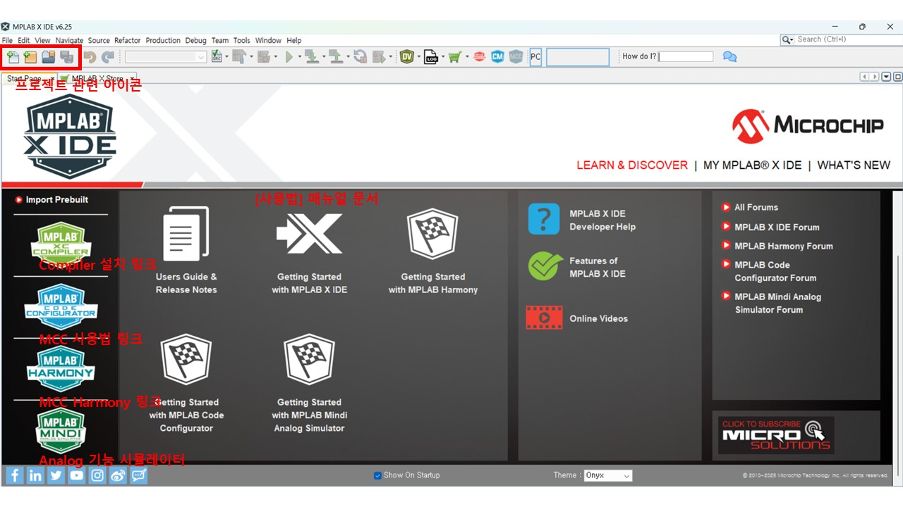

## MPLAB X IDE
개발 전 과정(설계·코딩·빌드·디버그)
- 편집기, 빌드, 시뮬레이터, 디버거, 코드 생성기(MCC/Harmony)
    - 편집기 : NetBeans 기반 C/C++ 에디터를 내장
    - 빌드 : 컴파일러(XC8, XC16, XC32) 또는 GCC 기반 툴체인 사용, Makefile을 자동 생성·관리
    - 시뮬레이터 : CPU 명령어 레벨 시뮬레이션 + 주변장치(타이머, 인터럽트, I/O 등) 모의 실행
    - 디버거 : 실제 MCU와 ICSP/JTAG/SWD로 통신하며 하드웨어 실행 상태를 제어
    - 코드 생성기 (MCC/Harmony)
        - MCC : MPLAB Code Configurator, 8·16비트 MCU용
        - Harmony : MPLAB Harmony Framework, 32비트 MCU용

| 구분 | 기능 이름 | 설명 |
|------|-------------|------|
| 🧠 | **Code Metrics / Memory Usage** | 코드 크기 및 RAM 사용률 시각화. ROM/RAM 점유율 분석용 |
| 🟦 | **MPLAB Code Configurator (MCC)** | 주변장치 초기화 코드 자동 생성기. 클럭, 핀, UART, SPI, Timer 설정을 GUI로 구성 |
| 🟧 | **MPLAB Harmony Configurator** | PIC32 / SAM(ARM)용 프레임워크 구성기. TCP/IP, USB, RTOS 등 미들웨어 코드 자동 생성 |

### 사용방법
#### Creating Projects
- New Project
    - Microchip Embedded
        - Application Project(s) : 일반 펌웨어 개발, MCC/Harmony 코드 생성·디버깅
        - Prebuilt Project(s) : 외부 공급 HEX를 장비에 굽기, 멀티이미지 로딩
        - User Makefile Project : 사내 빌드 시스템/크로스환경 재사용, 고급 CI 연동
        - Library Project : 공용 드라이버/미들웨어 분리, 팀 개발/버전 관리
    - Select Device
        - Tool : 프로그래머/디버거/시뮬레이터 선택
            - Simulator : 보드 없이 코드 실행/디버깅
            - PICkit : 보급형 프로그래머/디버거
            - ICD : 인서킷 디버거(안정·속도↑)
            - ICE : 상위 에뮬/디버그(트레이스, 고급 트리거)
            - Curiosity/Starter Kits : 보드 온보드 디버거, 해당 개발보드 사용 시 선택
    - Select Project Name and Folder
        - Open MCC on Finish : 생성 완료 후 MCC 자동 실행
        - Encoding : UTF-8 (BOM 없음) 권장
    - 추가 팁
        - Harmony는 수동으로 활성화 (MCC Content Manager)
        - 왼쪽 
- Develop
- Debug
